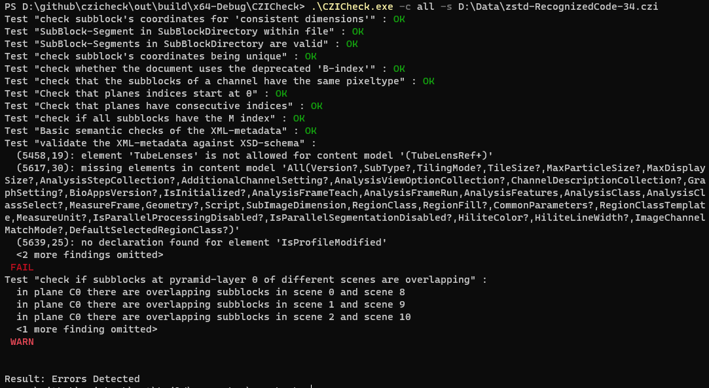

### usage


# synopsis

Running CZICheck with the `--help` option will print a brief summary of the available options and their usage:

```
CZICheck version 0.6.1, using libCZI version 0.62.6

Usage: CZICheck [OPTIONS]

Options:
  -h,--help                   Print this help message and exit
  -s,--source FILENAME        Specify the CZI-file to be checked.
  -c,--checks CHECKS-TO-BE-RUN
                              Specifies a comma-separated list of short-names of checkers
                              to run. In addition to the short-names, the following
                              "set-names" are possible : 'default' and 'all'. 'default'
                              means "all checkers which are not flagged as opt-in", and
                              'all' means "all available checkers". A minus ('-')
                              prepended to the checker-short-name (or set-name) means that
                              this checker or set is to be removed from the list of
                              checkers to run.
                              A plus('+') means that it is to be added, and this is also
                              the default if no plus or minus is prepended.
                              Examples:
                              "default, -benabled" : run all checkers in the "default set"
                                                     without the checker 'benabled'
                              "+benabled, +planesstartindex" : run only the checkers
                                                               'benabled' and
                                                               'planesstartindex'
                              Default is 'default'.

  -m,--maxfindings INTEGER    Specifies how many findings are to be reported and printed
                              (for every check).
                              A negative number means 'no limit'. Default is 3.

  -d,--printdetails BOOLEAN   Specifies whether to print details (if available) with a
                              finding. The argument may be one of 'true', 'false', 'yes'
                              or 'no'.

  -l,--laxparsing BOOLEAN     Specifies whether lax parsing for file opening is enabled.
                              The argument may be one of 'true', 'false', 'yes'
                              or 'no'. Default is 'no'.

  -e,--encoding ENCODING      Specifies which encoding should be used for result reporting.
                              The argument may be one of 'json', 'xml', 'text'. Default is 'text'.


The exit code of CZICheck is
 0  - all checks completed without an error or a warning
 1  - the checks found some warnings, but no errors
 2  - the checks gave one or more errors
 5  - the CZI-file could not be read or opened
 10 - the command line arguments are invalid

Available checkers (checkers enabled with the default set are marked with '*'):
* "subblkdimconsistent" -> check subblock's coordinates for 'consistent dimensions'
* "subblksegmentsinfile" -> SubBlock-Segment in SubBlockDirectory within file
  "subblksegmentsvalid" -> SubBlock-Segments in SubBlockDirectory are valid
* "subblkcoordsunique" -> check subblock's coordinates being unique
* "benabled" -> check whether the document uses the deprecated 'B-index'
* "samepixeltypeperchannel" -> check that the subblocks of a channel have the same pixeltype
* "planesstartindex" -> Check that planes indices start at 0
* "consecutiveplaneindices" -> Check that planes have consecutive indices
* "minallsubblks" -> check if all subblocks have the M index
* "basicxmlmetadata" -> Basic semantic checks of the XML-metadata
* "topographymetadata" -> Basic semantic checks for TopographyDataItems
  "xmlmetadataschema" -> validate the XML-metadata against XSD-schema
* "overlappingscenes" -> check if subblocks at pyramid-layer 0 of different scenes are overlapping
* "subblkbitmapvalid" -> SubBlock-Segments in SubBlockDirectory are valid and valid content
```

All checkers listed at the bottom are available for use. The ones marked with `[opt-in]` are not run by default, but can be enabled by adding them to the list of checkers to be run (or by using 'all' as argument for the '--checks' argument).

# example

Here is the output of a sample run:



All checkers run one after the other. If a checker finds a problem, it will print a message to the console. Those messages are categorized into three categories: `error`, `warning` and `info`. 
The result of a checker is then one of `OK`, `WARN` or `FAIL`. The result of the complete operation is then the aggregation of all checkers (and the return code of the application is then chosen
according to above table).

## output encoding

You can chose between 3 different encoding output encoding styles at the moment:

### Simple text

Run something like `./CZICheck -s yourfile.czi -e text`.
This encoding style is the default, therefore `-e text` is optional. It will provide the results in a simple, *human readable* formatting.

### Json encoding

Run something like `./CZICheck -s yourfile.czi -e json`.
The result will be a single JSON object containing

-   an aggregated result with the key `aggregatedresult`; its value indicates the result summary of all checks and is a string (`OK`, `WARN`, and `FAIL` are to be expected)
-   an array of checks at key `tests`

The tests array will provide exactly one JSON object per executed check.
Each of these objects contains the following members:

-   the name of the check with the key `name`; its value is a string
-   the description of the respective check with key `description`; its value is a string
-   the result of the respective test with key `result`; its value is a string (`OK`, `WARN`, and `FAIL` are to be expected)
-   an array of findings with key `findings`; this array can be of size 0 in case there were no findings (that also should coincide with a value of `OK` in the `result` member)

Finally, each of the findings will have

-   a severity indicating how severe the finding is with key `severity`; its value is a string (`INFO`, `WARNING`, and `FATAL` are to be expected)
-   a description of that finding with the key `description`; its value is a string
-   some details for this finding with the key `details`; its value is a string (note: this will only ever contain anything when the `--printdetails` command line flag was set)


Please note, that the output also identifies the version of the CZICheck application that was used with the `output_version` key. It contains the name of the application at `command` and the respective version at `version`.
See the following example:

    {
        "aggregatedresult": "FAIL",
        "tests": [
            {
                "name": "ConsistentSubBlockCoordinates",
                "description": "check subblock's coordinates for 'consistent dimensions'",
                "result": "OK",
                "findings": []
            },
            {
                "name": "BasicMetadataValidation",
                "description": "Basic semantic checks of the XML-metadata",
                "result": "WARN",
                "findings": [
                    {
                        "severity": "WARNING",
                        "description": "document statistics gives 1 channels, whereas in XML-metadata 2 channels are found.",
                        "details": ""
                    },
                    {
                        "severity": "INFO",
                        "description": "No sub block-information found for channel index 1, metadata pixelType: gray32float",
                        "details": ""
                    },
                    {
                        "severity": "WARNING",
                        "description": "No valid ComponentBitCount information found in metadata for channel #1.",
                        "details": ""
                    }
                ]
            },
            {
                "name": "ApplianceMetadataTopographyItemValid",
                "description": "Basic semantic checks for TopographyDataItems",
                "result": "FAIL",
                "findings": [
                    {
                        "severity": "WARNING",
                        "description": "There are superfluous dimensions specified in the TopographyDataItems. This might yield errors.",
                        "details": ""
                    },
                    {
                        "severity": "FATAL",
                        "description": "The Topography metadata specifies channels for the texture or heightmap subblocks, that are not present in the Subblock Collection of the image.",
                        "details": ""
                    }
                ]
            }
        ],
        "output_version": {
            "command": "CZICheck",
            "version": "0.6.1"
        }
    }

### XML encoding

The semantic of this is very similar to the json encoding (identical actually).
It simply uses slightly different keys.
These are

-   the aggregated result can be found at key `AggregatedResult`
-   the set of executed checks is at key `Tests`
-   each of the tests has a node identifier `Test` where the actual name of that test/check is stored in its `Name` attribute
-   each of these Tests has the elements
    -   `Result` indicating the check's result
    -   `Findings` which is the array of findings for that check
-   a finding node has the key `Finding`
-   the finding's severity is at key `Severity`
-   its description can be found in `Description`
-   and its details are under `Details`
-   the application version is under `OutputVersion` where `Command` denotes the application name and `Version` the respective version

See the following example:

    <?xml version="1.0" encoding="utf-8"?>
    <TestResults>
     <Tests>
      <Test Name="ConsistentSubBlockCoordinates">
       <Description>check subblock's coordinates for 'consistent dimensions'</Description>
       <Result>OK</Result>
       <Findings />
      </Test>
      <Test Name="BasicMetadataValidation">
       <Description>Basic semantic checks of the XML-metadata</Description>
       <Result>WARN</Result>
       <Findings>
        <Finding>
         <Severity>WARNING</Severity>
         <Description>document statistics gives 1 channels, whereas in XML-metadata 2 channels are found.</Description>
         <Details></Details>
        </Finding>
        <Finding>
         <Severity>INFO</Severity>
         <Description>No sub block-information found for channel index 1, metadata pixelType: gray32float</Description>
         <Details></Details>
        </Finding>
        <Finding>
         <Severity>WARNING</Severity>
         <Description>No valid ComponentBitCount information found in metadata for channel #1.</Description>
         <Details></Details>
        </Finding>
       </Findings>
      </Test>
      <Test Name="ApplianceMetadataTopographyItemValid">
       <Description>Basic semantic checks for TopographyDataItems</Description>
       <Result>FAIL</Result>
       <Findings>
        <Finding>
         <Severity>WARNING</Severity>
         <Description>There are superfluous dimensions specified in the TopographyDataItems. This might yield errors.</Description>
         <Details></Details>
        </Finding>
        <Finding>
         <Severity>FATAL</Severity>
         <Description>The Topography metadata specifies channels for the texture or heightmap subblocks, that are not present in the Subblock Collection of the image.</Description>
         <Details></Details>
        </Finding>
       </Findings>
      </Test>
     </Tests>
     <AggregatedResult>FAIL</AggregatedResult>
      <OutputVersion>
      <Command>CZICheck</Command>
      <Version>0.6.1</Version>
     </OutputVersion>
    </TestResults>

